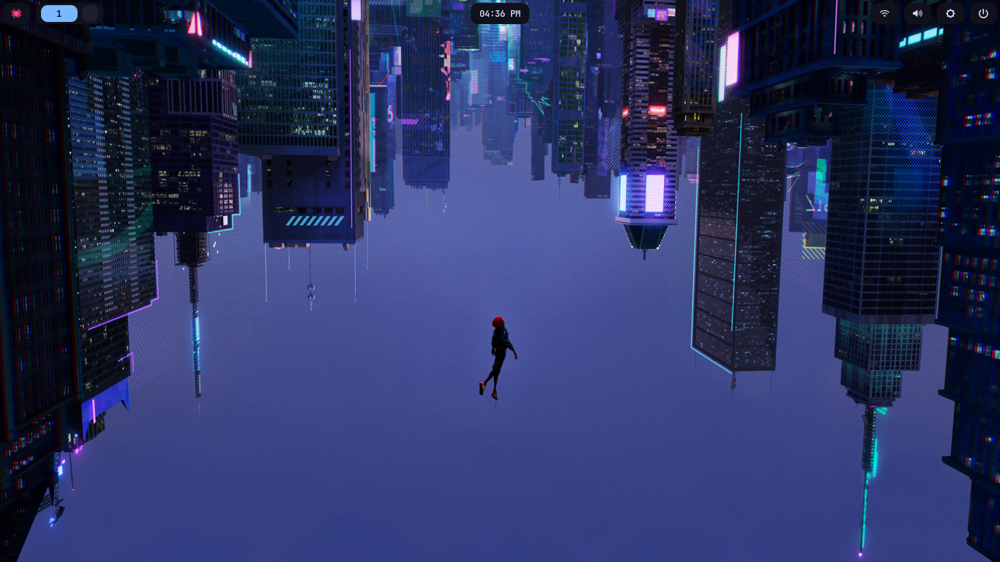
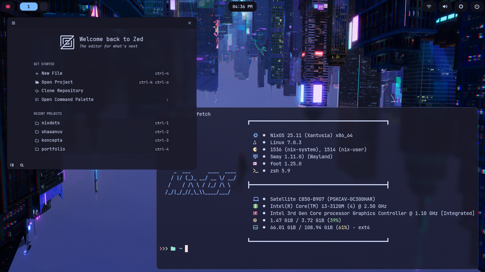
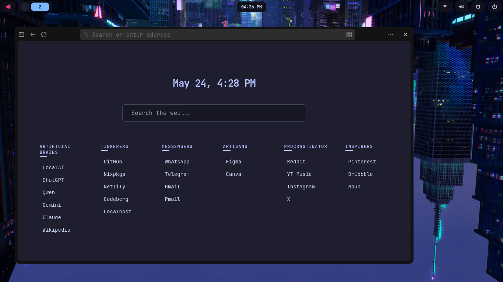

# nixdots

NixOS config for a minimal SwayFX setup.





## Stack

| Role | Package |
| --- | --- |
| WM | [SwayFX](https://github.com/WillPower3309/swayfx) |
| Font | [JetBrainsMono Nerd Font](https://github.com/ryanoasis/nerd-fonts) |
| Bar | [Waybar](https://github.com/Alexays/Waybar) |
| Launcher | [Rofi](https://github.com/davatorium/rofi) |
| Terminal | [Foot](https://codeberg.org/dnkl/foot) |
| Notifications | [Mako](https://github.com/emersion/mako) |
| Editor | [Zed](https://zed.dev/) + [Neovim](https://github.com/neovim/neovim) + [VSCodium](https://github.com/VSCodium/vscodium) |
| Browser | [Zen Browser](https://zen-browser.app/) |
| File manager | [Yazi](https://github.com/sxyazi/yazi) + [Thunar](https://gitlab.xfce.org/xfce/thunar) |
| Shell | [Zsh](https://www.zsh.org/) + [Oh-My-Zsh](https://github.com/ohmyzsh/ohmyzsh) |
| Login | [SDDM](https://github.com/sddm/sddm/) + [SilentSDDM](https://github.com/uiriansan/SilentSDDM) |
| Theme | [Catppuccin Mocha (color scheme)](https://catppuccin.com/palette/) + [Papirus-Dark (icons)](https://github.com/PapirusDevelopmentTeam/papirus-icon-theme/) + [Bibata-Modern-Classic (cursor)](https://github.com/ful1e5/Bibata_Cursor) |
| AI | [opencode](https://opencode.ai/) + [ollama](https://ollama.com/) |

## Fresh Install

### Install [NixOS](https://nixos.org/download/#nixos-iso) normally, then clone this dots
```bash
git clone https://github.com/shaaanuu/nixdots ~/nixdots
```

### Symlink to /etc/nixos

```bash
sudo ln -s /home/{USER}/nixdots /etc/nixos
```

change `{USER}` with your username.

### Swap in *your* hardware config

Replace `hardware-configuration.nix` with the one generated during your install (at `/etc/nixos/hardware-configuration.nix` before you symlink).

### Build

```bash
sudo nixos-rebuild switch --flake /etc/nixos#nixos
```

> The `update` alias in zsh does this exact command, so after the first build just run `update`.

## Modules

### `modules/zen.nix`

Zen Browser (beta) with:

- Forced extensions: [uBlock Origin](https://addons.mozilla.org/en-US/firefox/addon/ublock-origin/) + [Nook startpage](https://addons.mozilla.org/en-US/firefox/addon/startpage-nook/) (built by [me](https://github.com/shaaanuu/nook)).
- [Betterfox](https://github.com/yokoffing/BetterFox) (Fastfox + Securefox + Peskyfox)
- DNS-over-HTTPS via [Quad9](https://quad9.net/)
- [DDG](https://duckduckgo.com/) as default search + [`@nix`](https://search.nixos.org/packages), [`@w`](https://www.wikipedia.org/) aliases
- Telemetry, pocket, studies all disabled

### `modules/wireguard.nix`

ProtonVPN WireGuard interface. Needs private key at:

```bash
sudo mkdir -p /etc/wireguard
snvim /etc/wireguard/proton.key  # paste the key
```

### `modules/swaycut.nix`

Custom screenshot tool made by [me](https://github.com/shaaanuu/swaycut). Bindings are `Print`, `Super+Print`, `Super+Shift+Print`.


## Aliases

| Alias | Command |
| --- | --- |
| `update` | `sudo nixos-rebuild switch --flake /etc/nixos#nixos` |
| `upgrade` | `sudo nix flake update --flake /etc/nixos` |
| `clean` | `sudo nix-collect-garbage -d` |
| `vpn` | Start WireGuard ProtonVPN |
| `vpn-off` | Stop WireGuard ProtonVPN |
| `ai` | Start ollama |
| `ai-off` | Stop ollama |
| `snvim` | `sudo -E nvim` (preserves env, so the theme works) |
| `shutdown` | `sudo shutdown now` |
| `restart` / `reboot` | `sudo reboot now` |

Some would say it's not a good way to include `sudo` in it, but i don't care. I like this.

## Configs

All configs under `config/` are symlinked via `home.nix` using `mkOutOfStoreSymlink` so edits are live without rebuilding.

Currently rewriting most of this as possible in nix way into `modules/`.

## Keybindings

`Mod` = Super

| Key | Action |
| --- | --- |
| `Mod+Return` | Terminal (foot) |
| `Mod+d` | Rofi launcher |
| `Mod+q` | Kill window |
| `Mod+h/j/k/l` or arrow keys | Focus left/down/up/right |
| `Mod+Shift+h/j/k/l` | Move window |
| `Mod+f` | Fullscreen toggle |
| `Mod+v` | Split vertical |
| `Mod+Shift+v` | Split horizontal |
| `Mod+s/w/e` | Layout stack/tabbed/split |
| `Mod+Shift+Space` | Float toggle |
| `Mod+Space` | Focus float/tile toggle |
| `Mod+r` | Resize mode |
| `Mod+Shift+r` | Reload config |
| `Mod+Shift+q` | Exit swayfx |
| `Mod+1..0` | Switch workspace |
| `Mod+Shift+1..0` | Move to workspace |
| `Print` | Screenshot: focused workspace |
| `Mod+Print` | Screenshot: focused window |
| `Mod+Shift+Print` | Screenshot: region |
| `XF86AudioRaise/Lower/Mute` | Volume (My keyboard has this special button) |

## Notes

- **Grub device** is hardcoded to `/dev/sda` in `configuration.nix`. Change if needed.
- **Username** is hardcoded to `shaaanuu` throughout. Global find-replace if forking. (lazy, that's why).
- **Intel GPU** specific vars set: `LIBVA_DRIVER_NAME=i965`, `intel-vaapi-driver`, `libvdpau-va-gl`.
- **auto-cpufreq**: powersave + no turbo on battery, performance + auto turbo on charger.
- **nix substituters** include SJTU/USTC mirrors (currently for me, this is the fastest and less error showing ones).
- **[Flutter](https://flutter.dev/)** installed from nixpkgs-unstable. Android SDK paths set in `.zshrc` (manual Android setup needed at `~/dev/android`).
- **[Bun](https://bun.sh/)** paths set in zsh init (no installation process included).
- **iOS** support via `usbmuxd` + `ifuse` + `libimobiledevice`.

> THIS CONFIG IS HEAVILY UNDER DEVELOPMENT AND NOT A PERFECT ONE. DON'T BLAME ME IF YOU GOT ANY ISSUES WITH THIS.
> IF YOU FOUND ANY ISSUES, PLEASE CONSIDER [REPORTING](https://github.com/shaaanuu/nixdots/issues) IT.
